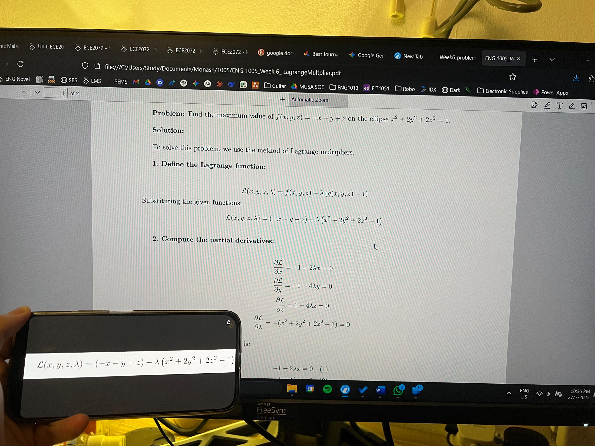
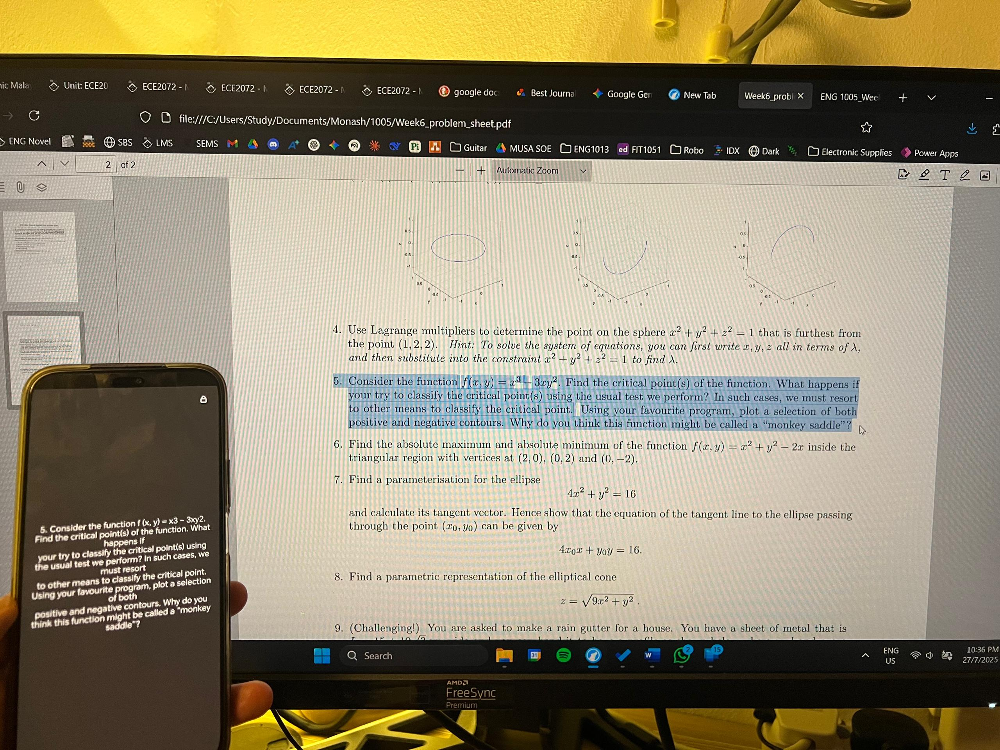

# ClipView

A powerful Android app that displays clipboard content (text and images) with advanced zoom, pan, and lock functionality. **Perfect for Windows Phone Link users** - automatically shows content copied on your PC in real-time on your Android device!

## 🌟 Key Features

- 📋 **Real-time clipboard monitoring** - Automatically displays clipboard content as it changes
- 🖼️ **Advanced image viewing** - Zoom, pan, and manipulate images with touch gestures
- 🔒 **Lock functionality** - Freeze the current display to prevent clipboard updates
- 📱 **Full-screen immersive mode** - Distraction-free viewing experience
- 🎯 **Smart auto-centering** - Images automatically center for optimal viewing
- 💾 **State preservation** - Maintains content across orientation changes and app restarts
- 🔗 **Windows Phone Link compatible** - Perfect companion for cross-device clipboard sharing

## 📱 Perfect for Windows Phone Link

This app is specifically designed for users with **Windows Phone Link** (Microsoft's cross-device solution). When you copy text or images on your Windows PC, they instantly appear on your Android device through ClipView, making it the perfect tool for:

- Quickly viewing images copied on your PC
- Reading long text copied from your computer
- Sharing content seamlessly between Windows and Android
- Having a dedicated clipboard viewer that works with Phone Link's cross-device clipboard

## 📥 Download APK

### 🎯 **Working APK Available!**
The latest working APK is now ready for download and installation.

### How to Get the APK:

#### Option 1: Build from Source (Recommended for Developers)
```bash
# Clone the repository
git clone https://github.com/QuietStudent/ClipView.git
cd ClipView

# Build the debug APK (recommended - easier to install)
./gradlew assembleDebug

# Your APK will be generated at:
# app/build/outputs/apk/debug/app-debug.apk
```

#### Option 2: Download from GitHub Releases
- Go to the [Releases page](../../releases)
- Download the latest `ClipView.apk` file
- *(Releases include pre-built, tested APK files)*

### 📍 **Current APK Status:**
✅ **Tested & Working** - The APK has been successfully tested on Android devices  
✅ **Phone Link Compatible** - Works with Windows Phone Link for cross-device clipboard sharing  
✅ **Ready for Installation** - No signing issues or compatibility problems

### Installation Instructions:

1. **Download the APK**:
   - From GitHub Releases or build from source (see above)

2. **Enable Unknown Sources**:
   - Go to Settings → Security → Install unknown apps
   - Enable installation from your browser/file manager

3. **Install the APK**:
   - Transfer the APK file to your Android device
   - Tap the file to install
   - Follow the installation prompts
   - Grant clipboard access permission when requested

4. **Start Using**:
   - Open ClipView app
   - Copy text or images on your PC (via Phone Link) or device
   - Content appears automatically in the app!

## 🚀 Usage

### Basic Usage:
1. Copy any text or image to your clipboard (on your device or PC via Phone Link)
2. The app automatically displays the content
3. For images: pinch to zoom, drag to pan
4. Press back button to re-center images

### Lock Feature:
1. Tap the **lock button** (🔓/🔒) in the top-right corner
2. **Unlocked mode**: Shows current clipboard content in real-time
3. **Locked mode**: Freezes the current display, ignores clipboard changes
4. Tap again to toggle between states

## 🔧 Requirements

- **Android API level 21+** (Android 5.0 Lollipop or newer)
- **Clipboard access permission** (automatically requested on first use)
- **Windows Phone Link** (optional, for cross-device functionality)
- **~6 MB storage space** for app installation

## 📸 Screenshots




## 🛠️ Development

### Building from Source:

1. **Clone the repository**:
   ```bash
   git clone https://github.com/QuietStudent/ClipView.git
   cd ClipView
   ```

2. **Open in Android Studio**:
   - Import the project
   - Sync Gradle files
   - Build and run

3. **Build APK**:
   ```bash
   # Debug APK (recommended - easier to install)
   ./gradlew assembleDebug
   
   # Release APK (optimized)
   ./gradlew assembleRelease
   ```

### Build Outputs:
- **Debug APK**: `app/build/outputs/apk/debug/app-debug.apk`
- **Release APK**: `app/build/outputs/apk/release/app-release-unsigned.apk`

### Project Structure:
```
ClipView/
├── app/
│   ├── src/main/
│   │   ├── java/com/example/clipview/MainActivity.java
│   │   ├── res/layout/activity_main.xml
│   │   └── res/drawable/ (lock/unlock icons)
│   └── build/outputs/apk/ (Generated APK files)
├── README.md
└── LICENSE
```

## 📝 License

This project is licensed under the **MIT License** - see the [LICENSE](LICENSE) file for details.

## 🤝 Contributing

Contributions are welcome! Here's how you can help:

1. **Fork the repository**
2. **Create your feature branch**: `git checkout -b feature/AmazingFeature`
3. **Commit your changes**: `git commit -m 'Add some AmazingFeature'`
4. **Push to the branch**: `git push origin feature/AmazingFeature`
5. **Open a Pull Request**

### Ideas for Contributions:
- Add support for more clipboard formats
- Improve UI/UX design
- Add settings/preferences screen
- Implement clipboard history
- Add dark/light theme toggle

## 🐛 Support & Issues

- **Found a bug?** [Open an issue](../../issues)
- **Have a feature request?** [Create a feature request](../../issues)
- **Need help?** Check the [discussions](../../discussions)

## 🌟 Show Your Support

If you find this app useful, please:
- ⭐ Star this repository
- 🍴 Fork it to contribute
- 📢 Share it with others
- 🐛 Report bugs to help improve it

---

**Made with ❤️ for seamless cross-device clipboard sharing**
